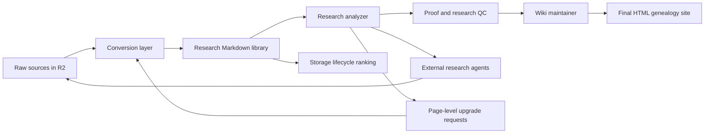
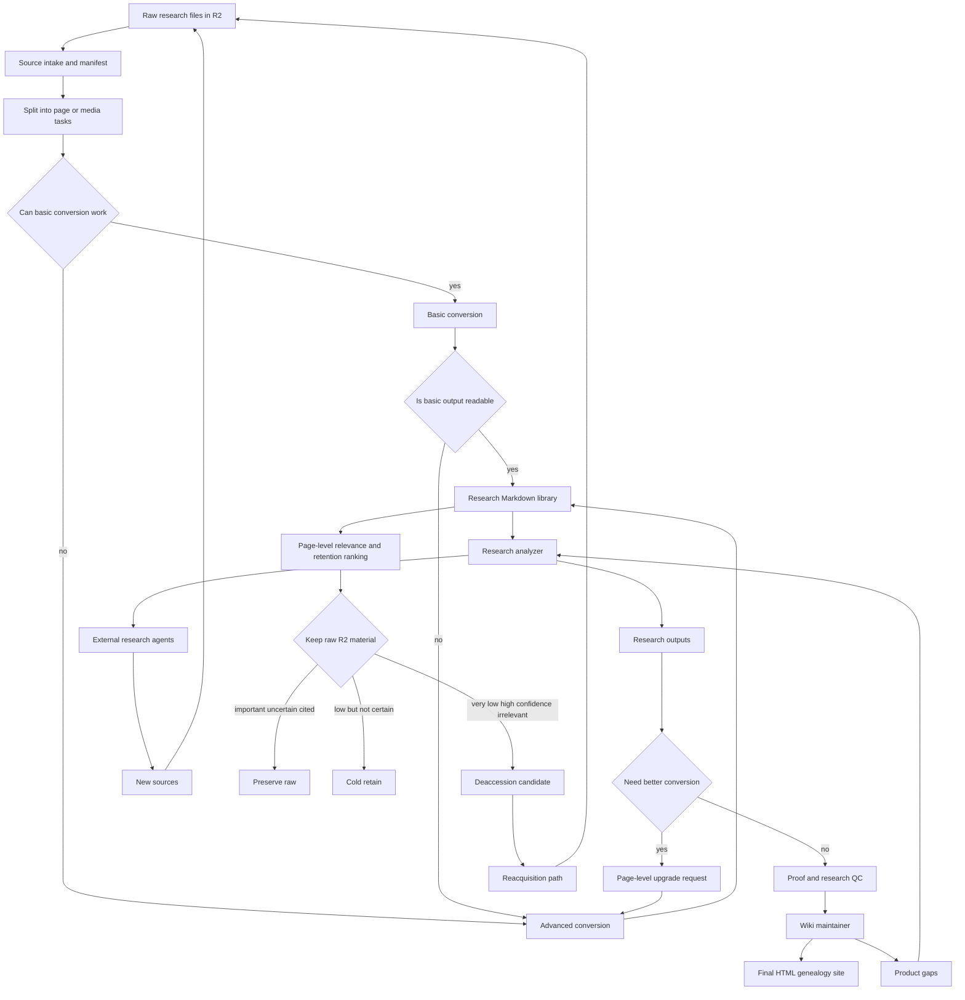

# Genealogy System Pipeline

This document is the working architecture for the cloud-first genealogy research system.
It captures the agreed product direction so future automation runs can keep improving the system without re-deriving the design.

## Core Loop

Raw sources enter R2, are converted into LLM-friendly research material, feed a genealogy-aware research layer, become reviewed evidence, and then become a final user-facing HTML genealogy site. Research work can request better conversion for exact pages and can find new raw sources, which re-enter the same pipeline.

## Full System Flow

## Storage Contract

- Cloudflare R2 stores raw source files and durable binary assets.
- Durable binary assets include meaningful crops, photos, maps, audio snippets, and video frames.
- GitHub stores code, Markdown, JSON, manifests, queues, chunks, staging data, proof data, and final HTML source/build files.
- Rendered page images are disposable worker cache and should not be durable R2 or GitHub assets.
- True page-level deletion from R2 requires page-level raw shards or page-level extracted source objects. If an 8000-page archive is stored as one PDF object, deleting one irrelevant page is not possible without first creating page-level storage units.

## Role Separation

### Conversion Layer

Purpose: make raw files readable by agents.

- Performs intake and media detection.
- Splits large sources into page or media tasks.
- Runs basic conversion where usable.
- Runs advanced Gemini conversion when basic output is unreadable, technically complex, or explicitly upgraded.
- Extracts only meaningful visual evidence.
- Writes converted Markdown and chunks to GitHub.

### Research Analyzer

Purpose: evidence-first internal research and research QC.

- Reads converted Markdown and chunks.
- Looks for names, dates, places, relationships, identity clues, conflicts, and gaps.
- Creates questions, hypotheses, source packets, staged claims, relationship candidates, and identity candidates.
- Marks exact pages for advanced conversion when family relevance emerges.
- Sends research questions to external research agents.
- Does not write the final product directly.

### Proof And Research QC

Purpose: protect the evidence layer.

- Reviews staged source packets, claims, relationships, and identity candidates.
- Accepts, rejects, or holds material.
- Preserves uncertainty and conflicts.
- Prevents unreviewed research from becoming canonical family history.

### Wiki Maintainer

Purpose: create the user-facing family-history product.

- Uses reviewed evidence only.
- Maintains people, families, timelines, narratives, photo pages, indexes, and family tree views.
- Produces the final HTML genealogy site rather than a Markdown-first final wiki.
- Finds product gaps and sends those gaps back to the research analyzer.

### External Research Agents

Purpose: expand the source universe.

- Search archives, web, databases, and other external repositories.
- Answer research questions.
- Download or identify new raw sources.
- Put new sources back into the R2 raw-source inbox.

### Storage Lifecycle Manager

Purpose: control R2 growth without losing research provenance.

- Scores source pages for relevance and irrelevance confidence.
- Keeps raw material for important, uncertain, cited, or legally/provenance-sensitive pages.
- Cold-retains low-relevance pages when uncertainty remains.
- Marks very low relevance pages as deaccession candidates only when a usable conversion and strong source locator exist.
- Keeps Markdown conversion, citation, acquisition path, hash, and reacquisition notes even when raw page-level material is removed.

## Trigger Logic

Advanced conversion is triggered by:

- Basic conversion is unreadable.
- The page is technically complex.
- The research analyzer marks exact page(s) as family-relevant.
- The wiki maintainer identifies a product gap requiring more source detail.
- The page contains meaningful visual evidence worth extracting.

For large archival corpora, the scheduled source-prep workflow may hold unrequested Gemini fallback after Docling/basic discovery. This keeps the corpus searchable and page-addressable at very low cost while preserving the raw R2 source and the page-level upgrade path. Exact pages marked by research relevance, QC, or targeted validation still bypass the hold and receive Gemini Flash/Pro treatment as needed.

Storage deaccession is allowed only when:

- The page has a usable conversion.
- Provenance and reacquisition information are saved.
- Relevance is low.
- Irrelevance confidence is high.
- The system is deleting safe page-level material, or the user knowingly accepts whole-object deletion risk.

## Current Implementation Status

- Implemented: cloud GitHub Actions conversion workflow.
- Implemented: R2 raw-source storage.
- Implemented: GitHub Markdown, JSON, queue, manifest, chunk, and automation state storage.
- Implemented: page-level source-prep tasks.
- Implemented: Docling rough discovery.
- Implemented: cloud source-prep workflow runs Docling baseline conversion on all queued pages in the scan window, extracts Docling picture images, passes usable Docling pages forward, and automatically routes unusable pages to Gemini elevation.
- Implemented: cloud source-prep remains available through manual dispatch and raw-source pushes, but the scheduled conversion loop is disabled while the project focuses on hosted internal research from existing conversions. This prevents the internal wiki population loop from spending provider API work on document conversion unless conversion is explicitly requested.
- Implemented: cloud source-prep push triggers are limited to source-prep inputs and conversion code so internal research/dashboard commits do not restart document conversion.
- Implemented: Gemini Lite/Pro conversion routing.
- Implemented: parallel Gemini page conversion.
- Implemented: large-corpus economy fallback mode, where Docling/basic outputs and page locators are preserved but unrequested Gemini fallback on very large archival sources is held until research relevance or targeted validation asks for it.
- Implemented: deterministic born-digital PDF fastlane before paid Gemini fallback.
- Implemented: page-level upgrade feedback command and state file.
- Implemented: meaningful crop extraction from Gemini-declared visual regions.
- Implemented: prevention of duplicate live queue tasks for overlapping source pages.
- Implemented: hosted internal research agent workflow for conversion QA, evidence extraction, identity analysis, proof review, and safe promotion, using ChatGPT-managed Codex auth rather than provider API keys.
- Implemented: durable internal-agent run logs/state plus hosted snapshot/reset/semantic-merge publishing so workers can keep updating even when other scheduled workflows push during a long run.
- Partial: research wiki and staging structure.
- Partial: proof/QC and promotion structure.
- Partial: automated wiki maintainer producing final HTML.
- Not done: external research agents feeding new R2 sources.
- Not done: storage lifecycle ranking and deaccession workflow.
- Not done: whole-system dashboard.

## Next Build Priorities

1. Build the research-analyzer loop that reads converted chunks and writes page-level upgrade requests.
2. Build source intake monitoring so new R2 raw files are registered automatically.
3. Build status/dashboard artifacts for source conversion, research readiness, page upgrades, and storage lifecycle.
4. Define the final HTML site generator structure.
5. Add storage lifecycle ranking records at the page level.
