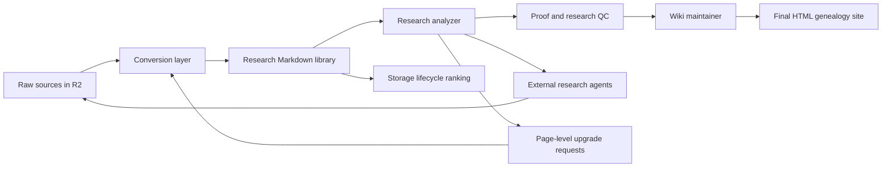
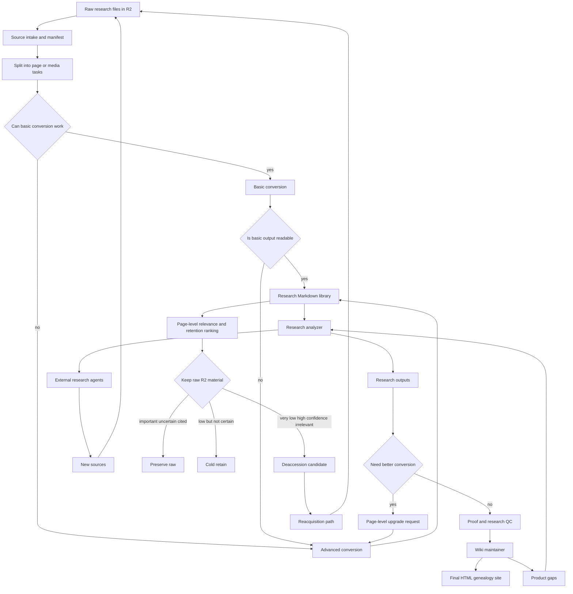

# Genealogy System Pipeline

This document is the working architecture for the cloud-first genealogy research system.
It captures the agreed product direction so future automation runs can keep improving the system without re-deriving the design.

## Core Loop

Raw sources enter R2, are converted into LLM-friendly research material, feed a genealogy-aware research layer, become reviewed evidence, and then become a final user-facing HTML genealogy site. Research work can request better conversion for exact pages and can find new raw sources, which re-enter the same pipeline.

## Full System Flow

## Storage Contract

- Cloudflare R2 stores raw source files and durable binary assets.
- Durable binary assets include meaningful crops, photos, maps, audio snippets, and video frames.
- GitHub stores code, Markdown, JSON, manifests, queues, chunks, staging data, proof data, and final HTML source/build files.
- Rendered page images are disposable worker cache and should not be durable R2 or GitHub assets.
- True page-level deletion from R2 requires page-level raw shards or page-level extracted source objects. If an 8000-page archive is stored as one PDF object, deleting one irrelevant page is not possible without first creating page-level storage units.

## Role Separation

### Conversion Layer

Purpose: make raw files readable by agents.

- Performs intake and media detection.
- Splits large sources into page or media tasks.
- Runs basic conversion where usable.
- Runs advanced Gemini conversion when basic output is unreadable, technically complex, or explicitly upgraded.
- Extracts only meaningful visual evidence.
- Writes converted Markdown and chunks to GitHub.

### Research Analyzer

Purpose: evidence-first internal research and research QC.

- Reads converted Markdown and chunks.
- Looks for names, dates, places, relationships, identity clues, conflicts, and gaps.
- Creates questions, hypotheses, source packets, staged claims, relationship candidates, and identity candidates.
- Marks exact pages for advanced conversion when family relevance emerges.
- Sends research questions to external research agents.
- Does not write the final product directly.

### Proof And Research QC

Purpose: protect the evidence layer.

- Reviews staged source packets, claims, relationships, and identity candidates.
- Accepts, rejects, or holds material.
- Preserves uncertainty and conflicts.
- Prevents unreviewed research from becoming canonical family history.

### Wiki Maintainer

Purpose: create the user-facing family-history product.

- Uses reviewed evidence only.
- Maintains people, families, timelines, narratives, photo pages, indexes, and family tree views.
- Produces the final HTML genealogy site rather than a Markdown-first final wiki.
- Finds product gaps and sends those gaps back to the research analyzer.

### External Research Agents

Purpose: expand the source universe.

- Search archives, web, databases, and other external repositories.
- Answer research questions.
- Download or identify new raw sources.
- Put new sources back into the R2 raw-source inbox.

### Storage Lifecycle Manager

Purpose: control R2 growth without losing research provenance.

- Scores source pages for relevance and irrelevance confidence.
- Keeps raw material for important, uncertain, cited, or legally/provenance-sensitive pages.
- Cold-retains low-relevance pages when uncertainty remains.
- Marks very low relevance pages as deaccession candidates only when a usable conversion and strong source locator exist.
- Keeps Markdown conversion, citation, acquisition path, hash, and reacquisition notes even when raw page-level material is removed.

## Trigger Logic

Advanced conversion is triggered by:

- Basic conversion is unreadable.
- The page is technically complex.
- The research analyzer marks exact page(s) as family-relevant.
- The wiki maintainer identifies a product gap requiring more source detail.
- The page contains meaningful visual evidence worth extracting.

Storage deaccession is allowed only when:

- The page has a usable conversion.
- Provenance and reacquisition information are saved.
- Relevance is low.
- Irrelevance confidence is high.
- The system is deleting safe page-level material, or the user knowingly accepts whole-object deletion risk.

## Current Implementation Status

- Implemented: cloud GitHub Actions conversion workflow.
- Implemented: R2 raw-source storage.
- Implemented: GitHub Markdown, JSON, queue, manifest, chunk, and automation state storage.
- Implemented: page-level source-prep tasks.
- Implemented: Docling rough discovery.
- Implemented: Gemini Lite/Pro conversion routing.
- Implemented: parallel Gemini page conversion.
- Implemented: page-level upgrade feedback command and state file.
- Implemented: meaningful crop extraction from Gemini-declared visual regions.
- Implemented: prevention of duplicate live queue tasks for overlapping source pages.
- Implemented: page-metadata-aware chunking so multi-page conversions produce page-correct chunks and queues.
- Implemented: automated research-analyzer chunk scan with page-level upgrade feedback.
- Implemented: research-analyzer question queue and Markdown work items for page-level genealogy signals.
- Implemented: research-analyzer page recommendations for staged source packets, claims, relationships, identity review, and conversion corrections.
- Implemented: page-level upgrade request JSON and Markdown dashboard artifacts.
- Implemented: research-analyzer staging-opportunities JSON and Markdown reports for queued draft work.
- Implemented: research-analyzer staging-backlog JSON and Markdown handoff with conversion-QA gate status.
- Implemented: research-analyzer genealogy lead index with page-level source provenance.
- Implemented: research-analyzer lead classification and review-status counts for dashboard triage.
- Implemented: research-analyzer lead review queue with conversion-QA gate blocking.
- Implemented: research-analyzer external-research request artifacts and queue for repeated unresolved leads, with conversion-QA gates and R2 intake routing.
- Implemented: external-research result note staging so source-discovery outcomes can be recorded without canonical wiki edits or GitHub binary storage.
- Implemented: external-research result notes include R2 intake candidate registers for raw-source finds.
- Implemented: research-analyzer staging-opportunity readiness gates from conversion QA and reread holds.
- Implemented: research-analyzer question prompt packets that use the shared agent-queue/task-state contract.
- Implemented: research-analyzer question tasks honor conversion-QA page holds before evidence extraction.
- Implemented: research-analyzer question tasks block on pending conversion-QA review before staged extraction.
- Implemented: conversion-QA queue prompts include research-analyzer opportunity context for blocked pages.
- Implemented: evidence-extraction queue blocks on pending conversion-QA review before staged claim work.
- Implemented: cloud heartbeat runs the research-analyzer loop and reports its research-question queue.
- Implemented: cloud heartbeat keeps conversion-QA gate queues materialized by default.
- Implemented: cloud heartbeat refreshes the final static site and whole-system dashboard artifacts.
- Implemented: R2 source intake monitoring that registers remote raw sources in GitHub manifests.
- Implemented: cloud heartbeat can run R2 source intake monitoring without restoring raw originals.
- Implemented: R2 source intake preflight report that records GitHub-safe readiness, missing config, and no secret values.
- Implemented: whole-system dashboard summarizes latest R2 source-intake status and counts.
- Implemented: whole-system source, queue, research, storage, and site dashboard artifacts.
- Implemented: whole-system dashboard next-action guidance from queue blockers and readiness signals.
- Implemented: whole-system queue-blocker summary for conversion-QA-gated downstream work.
- Implemented: conversion-QA unblock priority report mapping each QA task to blocked downstream extraction, question, lead, and external-research tasks.
- Implemented: conversion-QA unblock priority includes research-analyzer staging backlog items held by the QA gate.
- Implemented: conversion-QA queue tasks include unblock-impact counts and priority context from downstream research queues.
- Implemented: evidence-extraction tasks include research-analyzer staging backlog recommendations for matching pages.
- Implemented: evidence-extraction queue ordering prioritizes QA-cleared and analyzer-backed staged extraction work.
- Implemented: evidence-extraction tasks record priority rank and priority reason in queue records and prompts.
- Implemented: whole-system next actions point directly to the highest-impact conversion-QA prompt and unlock count.
- Implemented: conversion-QA next-focus packet gives the current highest-impact QA task as a stable Markdown handoff.
- Implemented: static HTML final-site generator structure for product wiki pages.
- Implemented: static HTML site build refreshes the generated Family Tree entry point.
- Implemented: final-site status report with HTML entry-point and source-page coverage checks.
- Implemented: static final-site search index and search page generated from public wiki pages.
- Implemented: non-destructive page-level storage lifecycle ranking and deaccession candidate records.
- Implemented: cloud heartbeat refreshes the non-destructive storage lifecycle report by default.
- Partial: research wiki and staging structure.
- Partial: proof/QC and promotion structure.
- Partial: deeper research analyzer extraction beyond page-upgrade and question routing.
- Partial: storage lifecycle deletion execution remains manual; no R2 deletion automation is implemented.
- Not done: automated wiki maintainer producing final HTML.
- Not done: external research agents feeding new R2 sources.

## Next Build Priorities

1. Build the research-analyzer loop that reads converted chunks and writes page-level upgrade requests.
2. Build source intake monitoring so new R2 raw files are registered automatically.
3. Build status/dashboard artifacts for source conversion, research readiness, page upgrades, and storage lifecycle.
4. Define the final HTML site generator structure.
5. Add storage lifecycle ranking records at the page level.
