# Implementation Flow

This is the simplified target flow: the human drops raw sources into `raw/sources/`; the system queues conversion work; Codex source-prep agents handle the document variation with skills and page/range subagents. OCR and PDF text layers are low-trust signals, not the main converter.

```mermaid
flowchart LR
    classDef implemented fill:#e8f5ee,stroke:#2e7d50,color:#153b2a;
    classDef agent fill:#edf3ff,stroke:#315aa6,color:#1c2f55;
    classDef review fill:#fff7df,stroke:#a56d00,color:#3e2b00;
    classDef output fill:#eef8f1,stroke:#337447,color:#153b2a;
    classDef missing fill:#ffecec,stroke:#b23b3b,color:#4f1b1b,stroke-dasharray: 5 5;

    raw["raw/sources/<br/>Drop raw PDFs, images, text, audio, video, exports"]:::implemented
    prepare["genealogy-wiki prepare-sources<br/>Inventory sources, split big PDFs, create/advance conversion jobs"]:::implemented
    manifest["raw/source-prep-manifest.json<br/>Source hashes, media types, jobs, converted outputs"]:::implemented
    queue["raw/codex-conversion-jobs/<br/>Page-range jobs, page images, work orders, output paths, crop folders"]:::implemented
    agentQueues["genealogy-wiki agent-queues<br/>Machine-readable task queues + prompt packets"]:::implemented
    batchQueues["genealogy-wiki source-prep-batches<br/>Contiguous page-range prompts for faster safe worker passes"]:::implemented
    taskState["genealogy-wiki agent-task<br/>Durable claim/start/complete/fail/release state"]:::implemented
    pageCache["source-prep-page-cache.json<br/>Cached page-output review by path, size, and mtime"]:::implemented
    staleLeases["agent-queues --stale-minutes<br/>Release interrupted claimed/in-progress work"]:::implemented
    githubDb["GitHub database<br/>Converted Markdown, chunks, research notes, canonical wiki"]:::output
    syncBridge["00 GitHub Database Sync Bridge<br/>Push safe post-conversion text state; keep raw/page images local"]:::implemented

    orchestrator["source-prep Codex agent<br/>Uses source-prep-pipeline + historical-document-conversion skills"]:::agent
    automations["Local Codex conversion automations<br/>Run opportunistically when the laptop is awake"]:::agent
    cloudAgents["Worktree/cloud agents<br/>Use GitHub-backed text state only"]:::agent
    workers["source_converter subagents<br/>Own one source or page range at a time"]:::agent
    pageOutputs["page-markdown/ + extracted-images/<br/>Literal transcription, translation, interpretation, uncertainty, visual crops"]:::agent
    assemble["genealogy-wiki codex-assemble<br/>Build converted source when page outputs are complete"]:::implemented
    converted["raw/converted/*.codex.md<br/>Auditable converted source"]:::implemented
    chunks["genealogy-wiki prep-chunk<br/>Page-scoped raw/chunks/ navigation"]:::implemented

    autoQc["genealogy-wiki conversion-qc<br/>Page-level bad conversion, relevance, and name-drift filter"]:::implemented
    qcPages["research/_conversion-review/qc-pages.json<br/>Machine-readable page holds for unsafe extraction"]:::implemented
    sourceStatus["genealogy-wiki source-status<br/>Raw-source usability report"]:::implemented
    qa["conversion_qa_reviewer agent<br/>Refine exact reread pages/regions before extraction"]:::review
    staging["research/_staging/<br/>Draft packets, claims, relationships, identity/conflict candidates"]:::review
    proof["claim_reviewer / proof review<br/>Literal support, uncertainty, reliability, conversion confidence"]:::review
    promote["wiki_promoter<br/>Promote reviewed material only"]:::review

    canonical["Canonical wiki/<br/>claims, relationships, people, families, events, places, evidence"]:::output
    indexes["genealogy-wiki index + graph<br/>research/_indexes/*.json"]:::output
    tree["genealogy-wiki tree<br/>wiki/Family Tree.md"]:::output
    narrative["genealogy-wiki narrative<br/>claim-based narrative skeleton"]:::output
    lint["genealogy-wiki lint<br/>structure, links, packets, chronology"]:::output

    missingRunner["Missing: full scheduler<br/>priority budgets, fairness, worker slots, and adaptive batch sizing"]:::missing
    missingRouting["Missing: source-type routing policy<br/>for handwritten, table, photo, audio, video, newspaper, and register sources"]:::missing
    missingQuality["Missing: stronger confidence reconciliation<br/>across agent readings, OCR, text layers, and review notes"]:::missing
    missingExtraction["Missing: automatic claim extraction, claim updates,<br/>status rules, confidence rubric, support/conflict linking, dedupe"]:::missing
    missingProduct["Missing: true ancestor/descendant charts,<br/>interactive UI, polished cited narratives, GEDCOM/CSV/Gramps"]:::missing

    raw --> prepare
    prepare --> manifest
    prepare --> queue
    queue --> agentQueues
    chunks --> agentQueues
    taskState --> agentQueues
    taskState --> batchQueues
    pageCache --> agentQueues
    agentQueues --> pageCache
    agentQueues --> batchQueues
    agentQueues --> staleLeases
    staleLeases --> taskState
    agentQueues --> automations
    batchQueues --> automations
    automations --> taskState
    automations --> orchestrator
    agentQueues --> orchestrator
    batchQueues --> orchestrator
    orchestrator --> workers
    workers --> pageOutputs
    pageOutputs --> assemble
    assemble --> converted
    converted --> chunks
    converted --> syncBridge
    chunks --> syncBridge
    canonical --> syncBridge
    syncBridge --> githubDb
    githubDb --> cloudAgents
    cloudAgents --> autoQc
    cloudAgents --> qa
    cloudAgents --> staging
    cloudAgents --> proof
    cloudAgents --> promote
    converted --> autoQc
    autoQc --> qcPages
    qcPages --> agentQueues
    qcPages --> sourceStatus
    manifest --> sourceStatus
    chunks --> sourceStatus
    agentQueues --> qa
    autoQc --> qa
    agentQueues --> staging
    chunks --> autoQc
    qa --> staging
    staging --> proof
    proof --> promote
    promote --> canonical
    canonical --> indexes
    canonical --> tree
    canonical --> narrative
    canonical --> lint
    indexes --> lint

    prepare -.-> missingRunner
    orchestrator -.-> missingRouting
    qa -.-> missingQuality
    staging -.-> missingExtraction
    canonical -.-> missingProduct
```

## Simplification

- One main intake action: drop files into `raw/sources/`, then run `genealogy-wiki prepare-sources --root .`.
- GitHub is the database after conversion. Local-only paths are `raw/sources/`, `raw/codex-conversion-jobs/`, `raw/assets/`, `research/_agent-queues/`, `.genealogy/`, and `obsidian-offline/`; cloud/worktree agents should work from GitHub-backed converted Markdown, chunks, research notes, staging drafts, and canonical wiki files.
- `scripts/sync-github-database.ps1` is the local bridge that commits and pushes only safe post-conversion database artifacts.
- `prepare-sources` does not pretend OCR is enough. It queues Codex conversion jobs and chunks completed conversions.
- Big PDFs are split into manageable page-range jobs with `--pages-per-job`, so conversion agents can work in parallel and resume without rereading the archive.
- `genealogy-wiki agent-queues --root . --stale-minutes 360` writes source-prep, conversion-QA, and evidence-extraction task queues under `research/_agent-queues/`, including per-task prompt packets.
- `genealogy-wiki source-prep-batches --root . --max-pages 8 --limit 25` writes contiguous page-range prompts for available source-prep tasks, so a Codex worker can handle a small range without re-orienting on every page.
- Queue refreshes cache source-prep page-output reviews in `research/_agent-queues/source-prep-page-cache.json`, so repeated automation runs do not reread thousands of unchanged page Markdown files.
- `genealogy-wiki conversion-qc --root .` writes page-level reread queues under `research/_conversion-review/`, so a huge source can be narrowed to the pages that are poor, relevant, or suspicious.
- Existing page outputs are not trusted just because a file exists. If a legacy output misses the current page-level conversion contract, source-prep marks it `needs_reread`.
- Evidence-extraction tasks overlapping QC-held or repair-needed pages are marked `blocked_needs_reread`; unrelated chunks from the same source remain available.
- `genealogy-wiki source-status --root .` writes `research/_indexes/source-usability.json` and `research/source-usability.md` so readiness is explicit by raw source.
- `genealogy-wiki agent-task claim|start|complete|fail|release <task-id> --root .` records worker state in `research/_agent-queues/task-state.json`; batch workers can pass multiple page task ids in one command.
- For unattended batches, workers use `--no-refresh` on individual `agent-task` updates, then run one final queue refresh. Claimed/in-progress work becomes available again after the stale timeout if the laptop shuts down mid-run.
- `codex-job`, `codex-next`, `codex-assemble`, and `prep-chunk` remain the underlying primitives, but the normal operator-facing flow is source drop plus agent-managed preparation.
- Source packets and staged claims come after conversion, not before. Empty packets should not be created just to satisfy process.
- `vault-transcriptions` is optional review ergonomics, not a required truth layer.
- Full QA is risk-based. Clean, low-value sources can pass through with lighter review; difficult or family-critical sources get conversion QA before extraction.

## What We Are Missing

- **Worker scheduler:** batch prompts now handle contiguous page ranges, but priority budgets, fairness across sources, worker slots, and adaptive batch sizing are still prompt-driven rather than a dedicated scheduler.
- **Routing:** source-type policies for when to split pages, when to spawn subagents, when to request crops, when to use OCR/text-layer hints, and when to escalate to QA.
- **Quality scoring:** stronger completeness checks, page-level confidence calibration, and reconciliation between OCR, PDF text layers, agent readings, and QA corrections.
- **Extraction automation:** claim extraction, claim updates/status rules, confidence rubric, support/conflict linking, and deduplication.
- **Product outputs:** stronger family-tree layouts, interactive review/tree UI, polished cited narratives, and GEDCOM/CSV/Gramps import/export.

## Source Trail

- `README.md` documents the public workflow and commands.
- `.agents/skills/source-prep-pipeline/SKILL.md` defines the source-prep agent workflow.
- `.agents/skills/historical-document-conversion/SKILL.md` defines page-level conversion standards.
- `AGENTS.md` defines subagent patterns and role boundaries.
- `docs/post_conversion_agent_workflow.md` defines QA, staging, proof review, and promotion gates.
- `docs/pipeline_references.md` records the external Codex and LLM Wiki references used to shape the workflow.
- `src/historic_doc_ingest/genealogy_wiki.py` implements the CLI primitives, source usability report, QC extraction holds, and queue task state.
