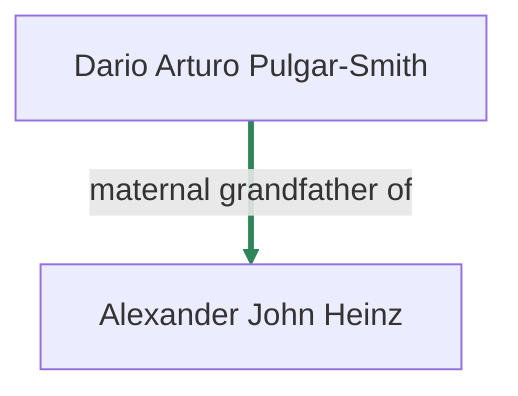

# Family Tree

```mermaid
flowchart TD
  n_people_dario_arturo_pulgar_smith["Dario Arturo Pulgar-Smith"] -->|maternal grandfather of| n_people_alexander_john_heinz["Alexander John Heinz"]
  linkStyle 0 stroke:#2f855a,stroke-width:3px;
```

This view shows the family connections currently represented in the wiki.
