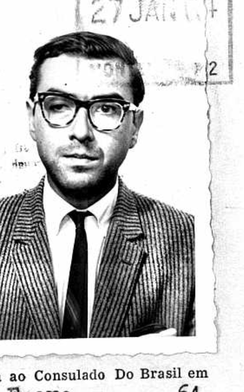

# Dario Pulgar Smith Portrait, 1964 Tourist Card

## Image

## Front Description

Portrait photograph cropped from a Brazilian tourist card issued or remitted around 27 January 1964. The person is a young man wearing glasses, a striped suit jacket, white shirt, and dark tie.

The identity is treated as source-context confirmed because the surrounding source page names the card holder as `DARIO PULGAR SMITH`, and this portrait is attached to that same card.

## Back Transcription

No separate reverse image is available for this cropped portrait.

## Translation

Not applicable to the cropped portrait. The surrounding tourist card is in Portuguese with typed Spanish-language field values.

## Interpretation

This crop is a confirmed reference portrait for Dario Pulgar Smith from source context. Use it to support photo organization, reference indexing, and later candidate review work.

## Faces

| Face | Identity Status | Person | Confidence | Notes |
| --- | --- | --- | --- | --- |
| face-001 | source_context_confirmed | [[people/dario-pulgar-smith]] | high | Identity supplied by the named tourist card that contains the attached portrait. |

## Scene And Object Clues

- The crop includes the portrait area of the tourist card and a partial printed/remittance date below.
- Source document includes the name `DARIO PULGAR SMITH`, birthplace/date as written `Concepcion 1/6/42`, nationality `CHILENA`, marital status `SOLTERO`, and parentage `DARIO Y DOROTHY`.

## Linked Events And Places

- Source conversion: `raw/converted/batch-img-015-ficha-de-turista-issued-by-the-brazilian-consulate-on-january-27-1964.codex.md`
- Source chunk: `raw/chunks/batch-img-015-ficha-de-turista-issued-by-the-brazilian-consulate-on-january-27-1964-codex/page-0001-chunk-01.md`
